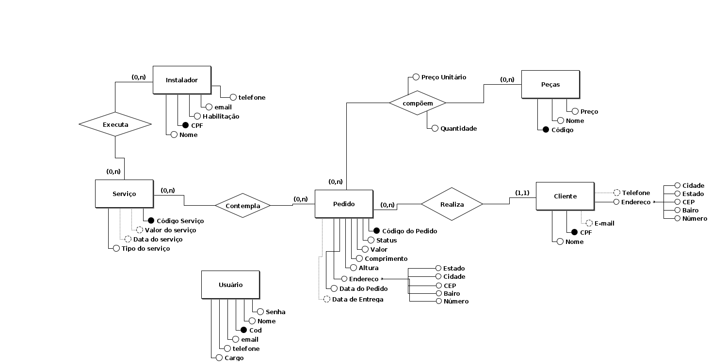
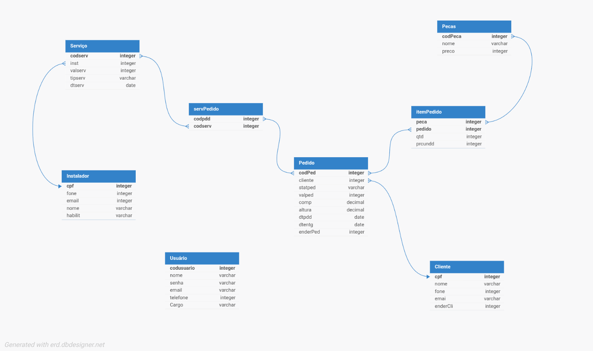
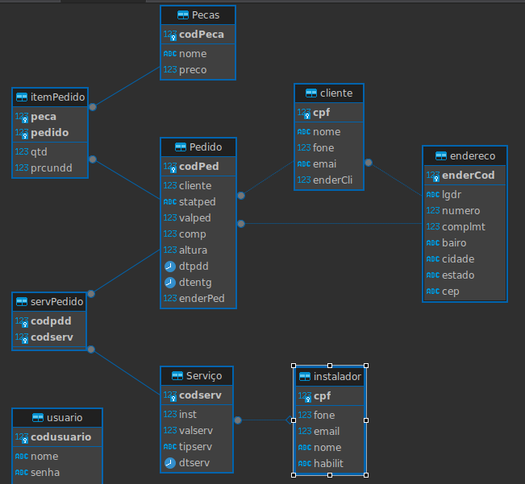

# Alterações Banco de Dados

Contem a explicação das alterações feitas nos documentos e artefatos da diciplina Banco de Dados.

## Requisitos

### Comentários:

- RF01: creio que telefone e email também deveriam fazer parte dos atributos

- RF04: tenho a impressão que devam existir mais atributos para uma peça (por exemplo, data de aquisição e quantidade)

- RF06: no pedido não existe o atributo endereço que imagino vem do cliente. Mas se o endereço do pedido não for o mesmo do cliente?

- RF07: o RF06 não cita nada a respeito do status, assim o 07 não teria como controlar

- RF08: não estão muito claros os atributos. O que seria  Curso de altura? Não precisa de telfone, email, etc.

### Coreções:

 - RF01: Adicionado ao documento os atributos e-mail e telefone, um descuido da nossa parte já que precisamos das informações até para recuperação da conta posteriormente.
 
- RF04: A Contec (empresa entrevistada), não possui uma necessidade de  controle  da quantidade de peças, isso porque ela é uma loja destinada à   instalação e venda de portões e não fabricação dos mesmos, a partir do momento que é feito um pedido para fábrica fornecedora do portão ele já vem com todas as peças necessárias, não necessitando de controle de estoque nem data de aquisição pois está atrelada a data do pedido.
 Talvez se pergunte por que peças então? Bom, elas servem para calcular o preço final do portão na hora de orçar o mesmo, portanto, a única coisa que precisamos saber é o valor das peças.
 

- RF06: Adicionado ao documento o atributo localização, descuido nosso realmente o cliente pode pedir um portão em outra localização.

- RF07: Adicionado ao documento o atributo Status.

- RF08: Removido curso de altura, é um curso necessário que o instalador deveria ter para instalar certos tipos de portão, mas deixaremos de fora por enquanto, adicionando email e telefone.

**OBS: Arquivo de requisitos foi atualizado**

[Requisitos](../Requisitos_Usuário.pdf)

## Modelo Conceitual

### Comentários:

1) A entidade Pedido tem alguns atributos opcionais que não indicados como opcionais no RF06. Verificar. Esta mesma entidade tem um atributos status que não consta no RF06.

2) A entidade Instalador possui alguns atributos opcionais que não constam como opcionais no RF08.

3) Veriicar como a aplicação vai controlar quando um pedido é de instalação e quando é de concerto. As consultas (relatórios) podem ficar complexos.

4) As minhas observações dos requisitos não foram implementadas ou explicadas.

### Coreções:

1) As medidas foram atualizadas para serem obrigatórias para um primeiro registro, e foi adicionada a opcionalidade das datas nas requisições.

2) Erro nosso, apesar de não ser obrigatório ter habilitação para entrar na empresa, é interessante ter a informação de que o instalador não possui a habilitação como dado, e não como nulo. Corrigido no modelo.

3) Realmente seria muito complicado gerir tudo isso e garantir a consistência. Para resolver o problema crio-se uma nova entidade para gerir tanto a instalação do pedido quanto a manutenção, nomeada de serviço, ela tem um atributo chamado tipo de serviço, que pode ser tanto uma instalação ou manutenção, relacionando-se ao instalador, que pode exercer as duas sem problemas no novo modelo.

4) Falha de comunicação entre a dupla.

Novo Modelo Conceitual
---

[Arquivo BRModelo](./Modelo_Conceitual.brM3)

## Modelo lógico

OBS: Professor você tem acesso ao repositório, se quiser comentar diretamente no markdown fique a vontade =)

## Modelo Físico

